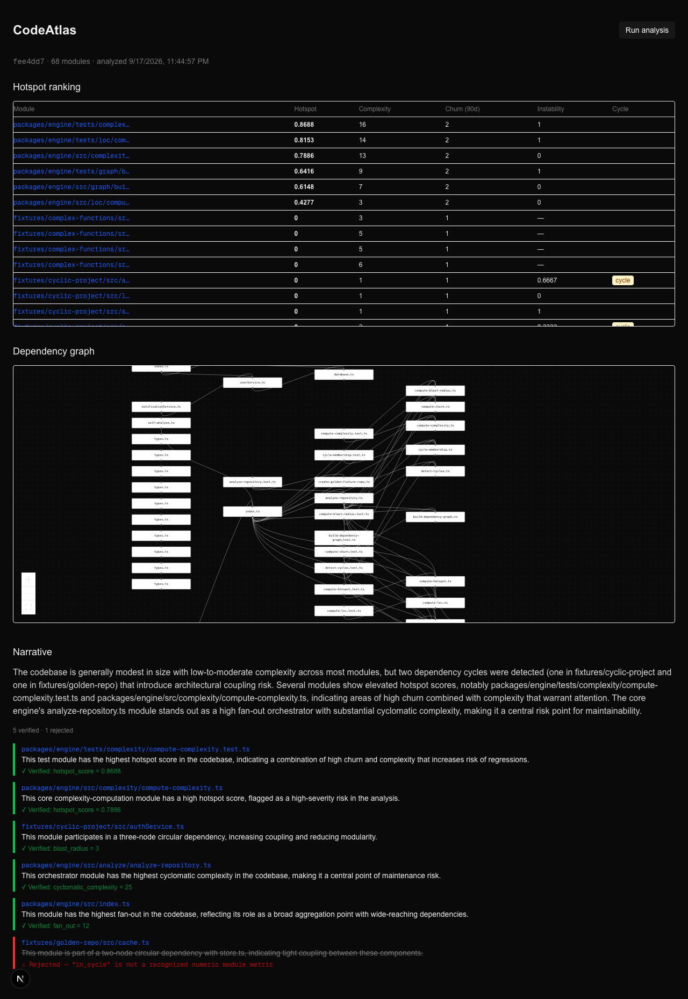
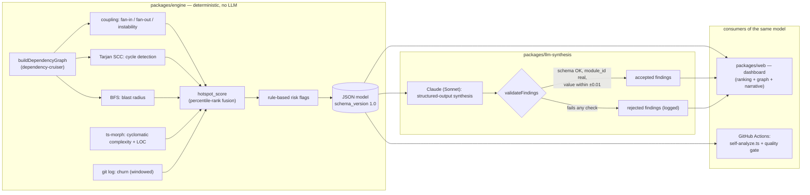

# CodeAtlas

Deterministic architecture & change intelligence for codebases — fuses dependency graphs, coupling/instability metrics, and Git churn into a single hotspot ranking, then runs one grounded LLM synthesis pass over the result that **rejects its own hallucinated claims** before they reach a human.

## What this is

CodeAtlas analyzes a TypeScript/JavaScript codebase's structure (import graph, coupling, instability, cycles, blast radius) and its history (Git churn, change concentration), fuses both into a deterministic hotspot score per module, and applies explicit rule-based risk flags — no LLM involved in any of that. A single LLM call then reads *only* that structured JSON (never raw source) and writes a short narrative with per-finding citations; every citation is mechanically checked against the same JSON before it's shown as "accepted."

This isn't a claim of novelty — tools like ArchMind, CodeMap, DevLens, and CodeAutopsy already do parts of this. What's different here:

1. **Coupling/instability is fused with churn into one deterministic hotspot score**, not shown as two disconnected metrics.
2. **A grounding/hallucination-rejection validator sits between the LLM and the user**: schema validation, referential integrity against real module IDs, and numeric-tolerance checks against the real computed values. Rejections are logged and shown, not hidden.
3. **CodeAtlas analyzes itself in CI as a quality gate**, not just as a demo target — see the [`self-analysis`](.github/workflows/ci.yml) job.

## Screenshot / demo GIF



Self-analysis of this repo: hotspot ranking, dependency graph (amber-bordered nodes and animated edges mark the two detected cycles), and the narrative panel with both an accepted and a rejected LLM finding.

## Architecture



`packages/engine` is pure and independently testable (graph, metrics, cycles, blast radius, complexity, LOC, churn, hotspot fusion, risk rules — each its own small module with its own unit tests). `packages/llm-synthesis` depends on it only for types and never sees raw source. `packages/web` is a thin Next.js layer over both.

## Highlights

- **Hotspot fusion**: `hotspot_score = percentile-rank(complexity) × percentile-rank(churn)`, where `percentile-rank(x) = |{v in population : v < x}| / (n-1)` — chosen specifically because min-max normalization lets a single outlier compress every other module's score toward zero (see [ADR 0004](docs/adr/0004-percentile-rank-normalization-for-hotspot-fusion.md)).
- **Grounding validator**: three checks in order — schema (Zod), referential integrity (does the cited `module_id` exist in the model?), numeric tolerance (is `value_cited` within ±0.01 of the real value?). A finding failing any check is dropped and logged, never silently kept.
- **Self-analysis as a CI quality gate**: every push runs `analyzeRepository` (deterministic only, no LLM, no API key) against the repo itself, publishes the JSON model as a build artifact, and fails the build if the max `hotspot_score` exceeds a defined threshold.
- **Cycle detection with a visual payoff**: Tarjan's SCC algorithm feeds directly into the dashboard's dependency graph — modules in a cycle get a distinct amber border and animated connecting edges, not just a boolean in a table.

## Out of scope (on purpose)

A few things this deliberately does **not** do, straight from the project's own scope discipline:

- **Auth, billing, multi-tenancy** — this is a single-user analysis tool, not a SaaS product; none of it has any demo value.
- **Universal multi-language support** — one language done correctly beats shallow coverage of many in a time-boxed build.
- **Security pattern detection** — a scope trap: either too shallow to be credible or too deep to fit the time available.
- **Auto-fix / code-rewriting agent** — a fundamentally different project (an agent that edits code), not an analysis-and-reporting tool.

## Getting started

Requires Node.js ≥ 20. An `ANTHROPIC_API_KEY` is required for the "Run analysis" flow specifically — it calls Claude for narrative synthesis as part of the same request as the deterministic analysis. Without a key, the deterministic engine (tests, the CI self-analysis job) still works fully; only the dashboard's analyze button needs one.

### Docker Compose (recommended)

```bash
cp .env.example .env
# edit .env, set ANTHROPIC_API_KEY=sk-ant-...

docker compose up --build
# open http://localhost:3000
```

### Manual (npm workspaces)

```bash
npm install
cp .env.example .env
# edit .env, set ANTHROPIC_API_KEY=sk-ant-...

npm run typecheck --workspaces --if-present
npm test --workspaces --if-present

npm run dev --workspace=@codeatlas/web
# open http://localhost:3000
```

## How this was built — real bugs found along the way

This project was built test-first throughout, and that discipline is what actually caught the three most interesting bugs below — none of them were hypothetical, all three were found by running real code against real (or precisely reproduced) conditions, not by inspection.

### 1. `dependency-cruiser` double-counted modules behind a symlinked temp dir

While building a fixture that needed a *real* (not static) git history, `buildDependencyGraph` started getting pointed at `mkdtemp`-created directories for the first time — and on macOS, `os.tmpdir()` sits behind a symlink (`/var` → `/private/var`). The same file started showing up twice, under two different path spellings, whenever it was part of a circular import.

**Root cause**: `dependency-cruiser` resolves a circular import's *target* via `realpath` internally, but does its initial file-system scan against the given (non-realpath'd) `baseDir` — the two disagree across a symlink boundary, and the same file gets treated as two different modules.

**Fix**: `fs.realpathSync(projectRoot)` before handing the path to `dependency-cruiser`. Caught with a regression test that reproduces a two-file cycle under a real `mkdtemp`'d directory, confirmed to fail before the fix and pass after.

### 2. `ts-morph`'s file discovery silently pruned whole subtrees based on `process.cwd()`

While wiring up the dashboard's dependency graph view, a self-analysis run from inside `packages/web` (exactly what `next dev` does) suddenly returned only ~20 fixture modules instead of the expected ~68 — `packages/engine`, `packages/web`, and `packages/llm-synthesis` had vanished entirely, even though every glob pattern passed to `ts-morph` was already absolute.

**Root cause (best understanding — not documented behavior)**: `ts-morph`'s glob-based file discovery appears to treat directories along `process.cwd()`'s own ancestor chain as already-visited and prunes them, taking any sibling reached only through that pruned ancestor down with it.

**Fix**: `computeComplexity` and `computeLoc` now `chdir` into the target root for the duration of the scan and restore the original `cwd` afterward. Reproducing this precisely required a synthetic directory shaped exactly like the monorepo (`cwd = target/packages/web`, target file under the sibling `target/packages/engine`) — and, notably, `realpathSync`-normalizing the temp directory first, since macOS's un-realpath'd `os.tmpdir()` accidentally defeated the very first version of the repro.

### 3. Next.js silently prerendered the live dashboard page as static HTML

While writing the Dockerfile for the one-command setup, a real `next build` run (no Docker needed to catch this) showed the home page marked `○ (Static)` in Next's own route table. The dashboard's home page reads an in-memory analysis cache via a plain function call — not one of Next's recognized dynamic data sources (`cookies()`, `headers()`, etc.) — so App Router had no way to know the page needed to be rendered fresh per request. In production, the page would have been baked in at build time (always showing "no analysis yet") and never updated again, no matter how many times `POST /api/analyze` succeeded afterward.

**Fix**: `export const dynamic = "force-dynamic"` on the page. Verified by rebuilding (confirmed the route now shows `ƒ`), then running the actual production server locally end-to-end: empty state before triggering an analysis, real module count and narrative after — proving the fix changes runtime behavior, not just the build log.

## Demo script (3 beats)

1. **Run CodeAtlas on itself, live.** The self-analysis CI job does this on every push; the dashboard's "Run analysis" button does it interactively.
2. **Run it on a recognizable repo**, land on the hotspot ranking, click into the top hotspot, show the real underlying numbers on its drill-down page — every claim on screen traces back to a raw metric.
3. **Trigger a rejected LLM claim, live.** Ask something ungroundable, or replay a corrupted response through `validateFindings` (see `packages/llm-synthesis/tests/validate-findings.test.ts` for pre-recorded good/bad examples), and show the validator catch it in the narrative panel — the rejected claim renders struck through in red, next to the exact reason it didn't pass.

## Architecture Decision Records

- [0001 — Instability is `NaN` (not defaulted) for isolated modules](docs/adr/0001-instability-nan-for-isolated-modules.md)
- [0002 — Type-only imports are excluded from the dependency graph](docs/adr/0002-type-only-imports-excluded-from-graph.md)
- [0003 — File-level cyclomatic complexity is the sum of its functions](docs/adr/0003-file-level-complexity-is-sum-of-functions.md)
- [0004 — Percentile-rank normalization for hotspot fusion (not min-max, not z-score)](docs/adr/0004-percentile-rank-normalization-for-hotspot-fusion.md)

## Docker Compose test status

Docker Compose dosyaları statik olarak gözden geçirildi (multi-stage build, git CLI dahil, env akışı); henüz gerçek `docker compose up` ile uçtan uca test edilmedi — dashboard yerine manuel `npm run dev --workspace=@codeatlas/web` yoluyla çalıştırılıp doğrulandı.
